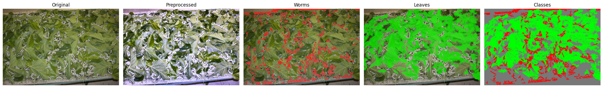

# Efficient Computer Vision Models for Silkworm Feeding Prediction and Habitat Analysis

##### Computer Vision - Master in Artificial Intelligence and Robotics, Sapienza University of Rome

---

- [Quick project informations](#quick-project-informations)
- [Classification results comparison](#classification-results-comparison)
- [How to run the notebooks](#how-to-run-the-notebooks)
- [Approach](#approach)
- [Dataset issues](#dataset-difficulties)
- [Results](#results)
- [Image Examples](#examples)

---

### Quick project informations

[Project proposal and objectives inside DESCRIPTION.md](DESCRIPTION.md)

#### People:
> 1986191: Leonardo Mariut \
> 2190452: Mohamed Zakaria Benjelloun Tuimy

#### Tested segmentation models:
> DINO \
> STEGO \
> U2Seg \
> SegFormer

#### Tested classification models:
> EfficientNetV2 \
> RepNeXt \
> MobileViT \
> Linear regressor 

#### Link to dataset:
> https://drive.google.com/file/d/1FM-CnQ1NrRSv-CD7C0-gnsR63hlRXsUp/view?ts=68419e2bV

#### Classification results comparison:

The scope of the project is to decide wether to feed silkworms or not (binary classification problem):

| Model name     | Accuracy | Precision | Recall | F1 Score | Specificity | False Positive Rate |
|----------------|----------|-----------|--------|----------|-------------|---------------------|
| EfficientNetV2 |          |           |        |          |             |                     |
| RepNeXt        |**0.9556**| 0.9653    | 0.9521 |**0.9586**| 0.9597      | 0.0403              |
| MobileViT      | 0.9074   | **0.9690**| 0.8562 | 0.9091   | **0.9677**  | **0.0323**          |
| Linear Regr.   | 0.9360   | 0.9280    | 0.9540 | 0.9410   | 0.9160      | 0.0840              |
| L. Reg. + Conv | 0.9480   | 0.9450    |**0.9580**| 0.9520 | 0.9370      | 0.0630              |

- The **first three models** achieved their results directly on the raw input images from the dataset.

- The **Linear Regression model** achieved its results by learning an optimal threshold between image masks (specifically betwwen the mask per class pixel counts), applied uniformly across the whole image.

- The **Linear Regression + Convolution model** also used only the image masks but divided each image into multiple regions. Each region had its own learned threshold, and the final output was obtained using a 2D convolution over all the cells.

---

### How to run the notebooks

To test and run the notebooks, first install the dependencies using the provided `requirements.txt` file:

```bash
pip install -r requirements.txt
````

<br>

After installing the requirements, make sure the dataset is correctly placed. All images and the associated CSV file with labels should be located under:

```bash
project_root/
└── data/
    └── images/
        ├── IMG_0001.jpg
        ├── IMG_0002.jpg
        ├── ...
        └── 0_data.csv
```

Once the dataset is in place, you can start by running `threshold_mask.ipynb`. This notebook will automatically generate two new folders:

* `project_root/data/preprocessed/` - containing the preprocessed images
* `project_root/data/masked/` - containing the generated image masks

<br>

To run the `SegFormer.ipynb` notebook, you’ll need to split the dataset into training, validation, and test sets. The structure should look like this:

```bash
project_root/
└── SegFormer/
    ├── train/
    │   ├── IMG_0001.jpg
    │   └── IMG_0001_mask.png
    │   ├── IMG_0002.jpg
    │   └── IMG_0002_mask.png
    ├── val/
    │   ├── IMG_0101.jpg
    │   └── IMG_0101_mask.png
    │   ├── IMG_0102.jpg
    │   └── IMG_0102_mask.png
    ├── test/
    │   ├── IMG_0201.jpg
    │   └── IMG_0201_mask.png
    │   ├── IMG_0202.jpg
    │   └── IMG_0202_mask.png
```

Each image must have its corresponding mask with the same filename and `_mask.png` suffix. Running the notebook will train the SegFormer model from scratch. Alternatively, you can skip training and load the pretrained model `segformer_b0_best.pth` by running the last cell of the notebook. This will generate predictions for the images inside the `test` folder, saving the output masks into:

```bash
project_root/SegFormer/inference/
```

<br>

All other notebooks require only that the images are present in `project_root/data/images`, **except for the linear regression notebooks**, which also require the masks generated by `threshold_mask.ipynb`.

---

### Approach

Following the proposed literature, we started by testing unsupervised models like **CutLER** and **STEGO**. Later, we also tried **U2Seg**, but the results were not very promising. Because of that, we experimented with other ideas, including testing **DINO** for feature extraction.

Since the standard methods weren’t giving us strong results, we also developed our own approaches. These included **heavy image preprocessing** and **color thresholding**, using linear regression on color ratios (for _the feed_ / _do not feed_ binary classification), and fine-tuning **SegFormer** for semantic segmentation.

---

### Dataset difficulties

The dataset comes with several challenges that impact both classification and segmentation. 

Camera positioning and framing vary a lot across samples, leading to inconsistent scales and perspectives. Some images are densely packed with silkworms, sometimes hundreds,often overlapping or tangled, which makes instance level analysis very difficult. Lighting conditions are inconsistent, with harsh shadows or overexposed regions in many cases. On top of that, the silkworms color is often similar to the background (leaves or mesh), reducing contrast and making it hard to distinguish them, especially under uneven illumination. The scenes are also visually cluttered, filled with leaves, stems, and netting that add noise. 

These factors lead to the segmentation vision models struggle and fail.


---

### Results

Achieved good self-supervised semantic segmentation (heuristics used, but no manual labelling) both with color thresholding and SegFormer. Achieved very good results on binary classification on raw images with all the tested models (feed / don't feed silkworms decision).

Looking at the results table, RepNeXt gave the best overall performance in terms of F1 Score (0.9586), showing strong balance between precision and recall. MobileViT reached the highest precision (0.9690) and lowest false positive rate (0.0323), meaning it's very careful when predicting a positive class, but it missed more positives than the others (recall 0.8562).

The linear regression model, while much simpler, still performed well with an F1 Score of 0.9410. It learned a single threshold over the full image masks, using just basic statistics of class balance (per class number of pixels). The extended version (Linear Regression + Convolution) improved the results even further (F1 Score 0.9520) by learning thresholds per region and combining them across the image, increasing slightly consistency.

Overall, for this specific task, even simple models gave competitive results when supported by good preprocessing or carefully chosen features. At the same time, combining these ideas with deep learning models like SegFormer gave more flexibility, especially for segmentation.

That said, there’s still a long way to go for unsupervised segmentation (panoptic, semantic, or instance-level). Current models often lack both strong performance and clear documentation, which makes them harder to use and compare fairly.


---

### Examples

| Random sample 1 | Random sample 2 | Random sample 3 |
|--------|---------|---------|
|  |  |  |

*Three random samples from the dataset*

---

*Heuristic self-supervised semantic segmentation example*

---

*SegFormer generated semantic mask example*

---

### Problematic Images

| Sample 1 | Sample 2 | Sample 3 |
|--------|---------|---------|
|  |  |  |